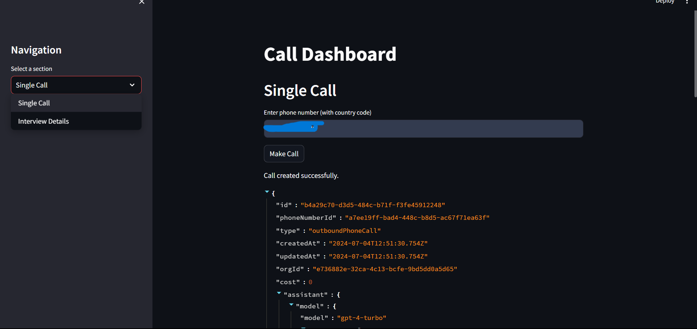

# AI Caller Information Provider

The **AI Caller Information Provider** is an AI-powered calling application that interacts with users, gathers their information, and provides detailed company-related details based on custom datasets. It integrates with Twilio for call management, OpenAI for AI training, and utilizes natural language processing (NLP) and speech recognition technologies.



## Features

- **User Interaction**: Engages users in natural conversations to collect and verify personal information (e.g., name, contact details, availability).

- **Company Information Retrieval**: Provides detailed company information based on user queries using a customizable dataset.

- **Twilio Integration**: Manages calls, handles user responses, and controls call flows using the Twilio API.

- **OpenAI Integration**: Trains the AI bot on a custom dataset to provide accurate and contextually relevant responses.

- **Google Calendar Integration**: Automatically schedules meetings and appointments in users' Google Calendars based on their availability and preferences.

## Installation

1. **Clone the Repository**:
   ```bash
   git clone https://github.com/your-username/ai-caller-info-provider.git
   cd ai-caller-info-provider
